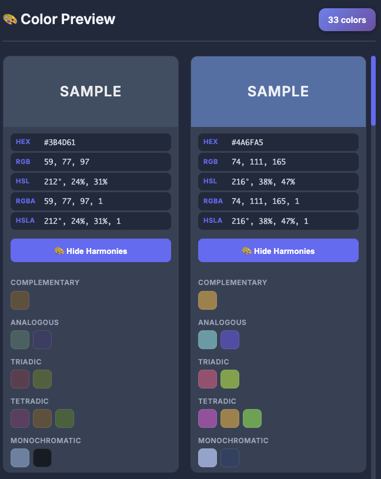
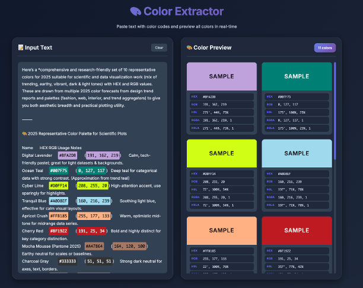

# 🎨 ColorSnap

Snap colors from text and preview all formats instantly.

You can try it at [thinkwee.top/colorsnap/](https://thinkwee.top/colorsnap/).

## Features

- **5 Color Formats** - HEX, RGB, RGBA, HSL, HSLA
- **Real-time Preview** - Instant color extraction and display
- **Smart Highlighting** - Auto text color based on brightness
- **One-Click Copy** - Click any format to copy
- **Auto Scroll** - Click highlighted color to locate card
- **New Features** - Add harmonies colors

## Usage

1. Open `index.html` in browser
2. Paste text with color codes
3. Click to copy any format

## Sample

